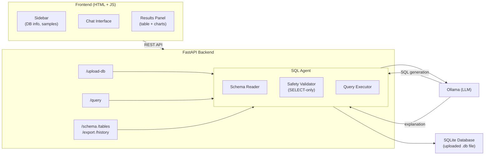

# SQL AI Assistant

Upload a SQLite database and query it in plain English. The AI generates safe SELECT queries, executes them, and explains the results with auto-generated charts.

## Quick Start

```bash
# Clone and go
cd sql-ai-assistant

# Configure Ollama endpoint
cp .env.example .env
# Edit .env — set OLLAMA_BASE_URL, OLLAMA_MODEL

# Run with Python
pip install -r requirements.txt
cd backend
uvicorn api:app --reload --port 8000

# Or run with Docker
docker compose up -d
```

Open http://localhost:8000, upload a `.db` file, and start asking questions.

## Architecture



## Features

- **Natural Language → SQL**: Ask questions in plain English; the AI generates SQL from your database schema
- **SQL Safety**: Only SELECT queries allowed — DELETE, DROP, UPDATE, etc. are rejected
- **AI Explanations**: Results are explained in plain English with business context
- **Auto Charts**: Bar, line, and pie charts auto-generated from numeric columns (Chart.js)
- **Export**: Download results as CSV, JSON, or SQL
- **Chat History**: Previous questions inform future query context
- **Docker**: One-command deployment with Docker Compose

## API Endpoints

| Method | Path              | Description                       |
|--------|-------------------|-----------------------------------|
| POST   | /api/upload-db    | Upload a SQLite database           |
| GET    | /api/schema       | Get full database schema           |
| GET    | /api/tables       | List tables with row counts        |
| POST   | /api/query        | Ask a question → SQL + results     |
| GET    | /api/history      | Conversation history                |
| GET    | /api/export/:fmt  | Export as csv/json/sql             |
| GET    | /api/health       | Health check                       |

## Tech Stack

- **Backend**: Python, FastAPI, httpx, SQLite
- **Frontend**: HTML, Tailwind CSS (CDN), Chart.js, vanilla JS
- **LLM**: Ollama (qwen3:8b, qwen2.5:3b)
- **Infra**: Docker, Docker Compose
